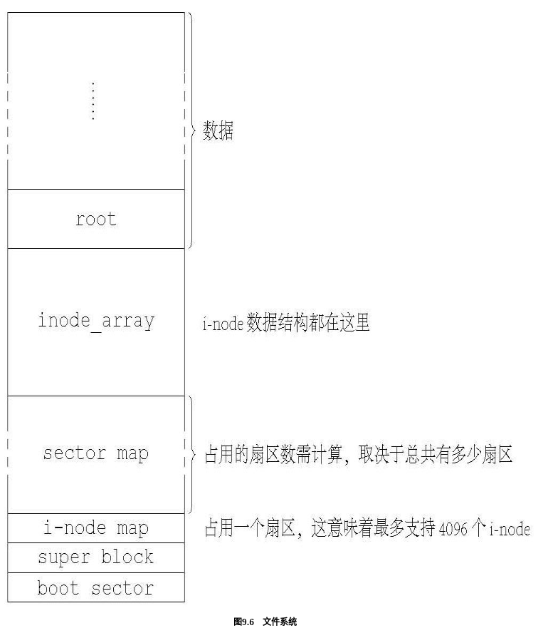

# Filesystem design

## 前言

Orange FS v1.0为我们提供了一个比较基础的文件系统,根据原书中的描述

> superblock通常也叫超级块关于文件系统的Metadata我们统统记在这里。sector map是一个位图它用来映射扇区的使用情况用1表示扇区已被使用0表示未使用。i-node是UNIX世界各种文件系统的核心数据结构之一我们把它借用过来。每个i-node对应一个文件用于存放文件名、文件属性等内容inode_array就是把所有i-node都放在这里形成一个较大的数组。而inode map就是用来映射inode_array这个数组使用情况的一个位图用法跟sector map类似。root数据区类似于FAT12的根目录区但本质上它也是个普通文件由于它是所有文件的索引所以我们把它单独看待。为了简单起见我们的文件系统暂不支持文件夹也就是说用来表示目录的特殊文件只有这么一个。这种不支持文件夹的文件系统其实也不是我们的首创历史上曾经有过而且这种文件系统还有个名字叫做扁平文件系统Flat File System。

另外在实现时,原书有描述

> 我们的inode结构体目前很简单其中i_start_sect代表文件的起始扇区i_nr_sects代表总扇区数i_size代表文件大小。在这里我们使用一个很笨拙的方法来存储文件那就是事先为文件预留出一定的扇区数i_nr_sects以便让文件能够追加数据i_nr_sects一旦确定就不再更改。这样做的优点很明显那就是分配扇区的工作在建立文件时一次完成从此再也不用额外分配或释放扇区。缺点也很明显那就是文件大小范围在文件建立之后就无法改变了i_size满足i_size ∊ [0, i_nr_sects × 512]。
>
> 笔者最终决定使用这种有明显缺陷的i-node原因还是为了简单即便它有千般不是它实在是太简单了以至于可以大大简化我们的代码而且它还是能用的。等到我们有很多文件需要灵活性时我们再推出一个v2.0那时需要改进的怕也不仅仅是一个i-node而已所以在做第一步时就让它傻一点吧。

可惜原书始终没有给出一个更现代的v2.0,目前的文件系统显然无法支持诸如多层目录路径以及灵活可变的文件大小来满足正常的需求.



## 我们的工作

在Orange FS v1.0的基础上改进为Orange FS fork v2.0

目前支持多层目录路径以及重新实现配合的创建文件,打开文件,读取文件,stat文件,删除文件等方法,更针对于实验课任务来说

- 列出当前目录文件`ls`,支持`-l`以显示文件属性,`-a`显示隐藏文件(`.`开头的文件).

- 创建文件,

  - `touch`命令创建空白文件,目前不支持任何flag;
  - `mkdir`命令创建空白文件夹,同样不支持任何flag

- 打开或编辑指定文件

  - `./executable`执行一个可执行文件
  - `si ./some.txt`一个模仿vi的超简单cli文件编辑器.

- 删除文件,`rm`命令额外新增`-r`,`-f`flag,效果和通用Linux中的同名flag相同.

- 进程管理
  - `ps`命令,不支持任何flag,列出当前运行的进程
  - `kill {pid}`命令,不支持任何flag,终止指定pid进程.


## 实现细节

### 大修原来的文件系统

> inode-map这个位图它的每一位都映射到 inode_array中的一个i-node。如果一个i-node被使用了inode-map中相应的位就应该是1反之则为0。第0个i-node被保留这里置为1. 第1个是 ROOT_INODE也置为1很快我们就要填充具体的i-node。
>
> 另外我们还添 加了三个文件分别是dev_tty0、dev_tty1和dev_tty2它们三个是特殊文件 我们将来会用到这里先占个位置也置为1。所以整个的inode-map目前只 使用了第一个字节其值为0x1F
>
> 再下面轮到sector-map了它的每一位表示一个扇区的使用情况。如 果第i个扇区被使用了那么sector-map中的第i位应为1这跟inode-map是类 似的。sector-map中的第0位也被保留由于第一个能用作数据区的扇区 是第sb.n_1st_sect块所以sector-map的第1位理应对应sb.n_1st_sect这在以 后 的 编 码 过 程 中 需 要 注 意 。 由 于 根 目 录 占 用 NR_DEFAULT_FILE_SECTS个扇区加上一个保留位我们总共需要置 NR_DEFAULT_FILE_SECTS+1个1
>
> 下面到了写具体的i-node了——我们一直称这块数据为inode_array 因为它其实也是个大数组array。注意写i-node的顺序一定要跟inode-map 中一致先是ROOT_INODE然后是dev_tty[0,1,2]
>
> ROOT_INODE的i_mode为I_DIRECTORY因为它是目录文件。目录 中目前存在四个条目分别为“.”、“dev_tty0”、“dev_tty1”和“dev_tty2”所 以它的i_size是DIR_ENTRY_SIZE_4。根目录文件是数据区的第一个文 件所以它的i_start_sect值为sb.n_1st_secti_nr_sects如前所述被赋值为 NR_DEFAULT_FILE_SECTS。

可以看出在原先的文件系统中,由于只能在创建inode的时候分配指定大小的扇区数量,而这些存储文件的扇区是连续的,因此日后拓展时无法在现有的数据结构上修改字段以实现更多扇区的分配. 在这里我们参考FAT32这种链式存储索引的方式,在现有i-node数据结构中增加一些字段,以实现指向更多数据的索引.

具体的做法是,i-node新增一个i_next_node(next i-node's numeric)字段,即下一个存放当前文件数据(存放本i-node放不下的剩余数据)的i-node在inode array中的索引.定义扩容逻辑如下,挡即将写入的文件的大小超过本文件i-node链的i_nr_sects * bytesPerSect之和prev_max_bytes时,新增一个i-node,其i_nr_sects为即将写入大小 (write_bytes * 1.5 - prev_max_bytes) / bytesPerSect 向上取整. 当无法分配时,判断剩余的扇区能否容纳写入文件的大小(不考虑扩更大的容),如果可以,分配并warning.如果不可以panic.

另外这里还有一些小tips:由于每个inode的i_nr_sects为u32类型,理论上最大可以存放$2^{32} \times 512 \text{bytes}$即2TBytes(这样单个文件的数据大小不大可能会在实验环境中出现)但是inode的i_size字段(u32类型)表示文件的大小(单位bytes),最多只能表达4GByte. 综合二者,出于简化考虑在本次实验中必须假设所有文件的单次变动大小不超过4GByte,每次扩容也只会扩一个inode,文件的总大小为所有inode的size之和.

为了这些扩容inode不会由于search_file而意外找到,他们的filename字段将被设计为特殊的不可打印字符串.


```c
/**
 * @struct inode
 * @brief  i-node
 *
 * The \c start_sect and\c nr_sects locate the file in the device,
 * and the size show how many bytes is used.
 * If <tt> size < (nr_sects * SECTOR_SIZE) </tt>, the rest bytes
 * are wasted and reserved for later writing.
 *
 * \b NOTE: Remember to change INODE_SIZE if the members are changed
 */
struct inode {
	u32	i_mode;		/**< Accsess mode */
	u32	i_size;		/**< File size (Bytes)*/
	u32	i_start_sect;	/**< The first sector of the data */
	u32	i_nr_sects;	/**< How many sectors the file occupies */
	u16 i_next_node; /**< Next inode numeric(nr) which stores the surplus data */
	u8	_unused[14];	/**< Stuff for alignment */

	/* the following items are only present in memory */
	int	i_dev;
	int	i_cnt;		/**< How many procs share this inode  */
	int	i_num;		/**< inode nr.  */
};
```


#### 修改文件操作方法

`main.c`

增加方法`PUBLIC void put_inodes_link(struct inode *pinode)`,`PUBLIC void sync_inode_link(struct inode *p)` 以提供对inode链的适配.

---

`open.c`

- `do_close()`

> 原先的流程:
>
> 1. 调用put_inode( )释放inode_table[ ]中的条目
> 2. 将filp[fd]->fd_inode清零释放f_desc_table[ ]中的条目
> 3. 将filp[fd]清零释放进程表中的fd条目。
>
> 经过这三个语句之前为文件所分配的资源就全部释放了文件也就可被认为是“关闭”了。

现在在put_inode()之前要找到以pcaller->filp[fd]->fd_inode开头的inode和链中其他所有inode.并对这些inode全部`put_inode()`

接着逻辑代码保持原样,因为只和file_desc有关.

```c
/**
 * @struct file_desc
 * @brief  File Descriptor
 */
struct file_desc {
	int		fd_mode;	/**< R or W */
	int		fd_pos;		/**< Current position for R/W. */
	int		fd_cnt;		/**< How many procs share this desc */
	struct inode*	fd_inode;	/**< Ptr to the first i-node */ // 新的修改这里
};
```

- `do_lseek()`

定位文件偏移,注意获取文件f_size的逻辑的变化以及跨inode的lseek.

- `do_open()`

除了file_desc的首inode外,还要对链中其余inode进行get_inode增加引用.

对于`else if (imode == I_DIRECTORY) `分支,现在不必断言其为root_inode了

- `create_file(char * path, int flags)`

无需改变.

- `new_dir_entry`

严格来说这个方法会往dir inode的数据区中写入数据.但是在初始化时分配的扇区够大(1MByte),而每个dir_entry又过小(16Byte),所以完全可以装下不必要再考虑扩展的问题.

---

`misc.c`

- `do_stat()`

除size要从链中所有节点信息综合,其他保持原样,文件属性只从首node读取.

由于文件大小可能超出4GB,但是在搜索引用时发现使用stat的场景下,会限定文件大小必须小于MMBUF_SIZE	= 0x100000,所以也不需要修改stat结构体.

- `int search_file(char * path)`

不用修改,不过逻辑上现在返回的时指定path文件的第一个inode.

另外目录的Inode足够大,因此不会拓展.

- `int strip_path(char * filename, const char * pathname, struct inode** ppinode)`

在原来的系统中由于由于扁平式的文件系统,文件都存储在根目录里,但是现在要进行多级目录,因此不能直接返回root_inode.

现在会递归的在上级目录中寻找,直到根目录.

---

`link.c`

- `unlink()`

在原来的逻辑中,清除了inode_array[]的相关项,现在需要根据inode链清除inode_array[]上所有和文件相关的inode

---

`read_write.c`

现在会在遍历inode的各个扇区外再遍历各个inode,pos的处理逻辑会更加复杂

参考c标准库的处理方式,对于大文件(size无法用原先int表示的),需要用户自行编写逻辑循环处理自己的大文件.


注意对inode的引用,fs中很多操作都是对fd的,fd数据结构包含有对首个inode的引用,但是在使用get_inode通过索引找下一个inode的时候会增加对之后inode的引用,需要在方法中注意删除其.(不如增加`get_inode_directly`,找inode而不增加引用)

### si文本编辑器

注意要cursor,改一个叫做disp_pos的(0<= value<80*25)的东西,写几个heade.h支持一下自定义的vi-min

